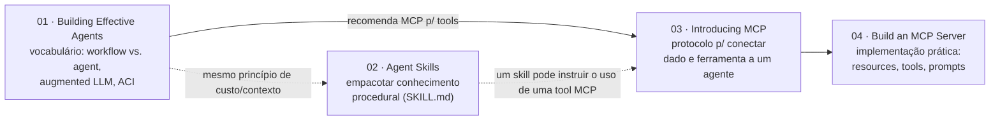

# Mapa conceitual — Fase 0

Como os quatro primeiros fichamentos deste repositório se encaixam.

## A leitura em uma frase por texto

1. **[Building Effective Agents](01-building-effective-agents.md)** — antes de construir qualquer coisa, decida se o problema pede um caminho fixo (workflow) ou controle dinâmico do modelo (agent); comece sempre pela opção mais simples.
2. **[Agent Skills](02-agent-skills.md)** — quando o "conhecimento de como fazer" é reutilizável, ele vira um pacote no filesystem que o agente descobre sob demanda, sem estourar contexto.
3. **[Introducing MCP](03-model-context-protocol.md)** — quando o agente precisa de dado ou ferramenta externa, o protocolo padroniza essa conexão em vez de cada integração ser um caso especial.
4. **[Build an MCP Server](04-build-mcp-server.md)** — a teoria de (3) virando um servidor de verdade, com a mesma disciplina de interface (ACI) que (1) já pedia em abstrato.

## O que fica pra depois

O quarto texto é o roteiro do `mcp-toy-server/` deste repositório — a Fase 0 só termina quando esse servidor estiver rodando de fato, não quando os quatro fichamentos estiverem prontos.
