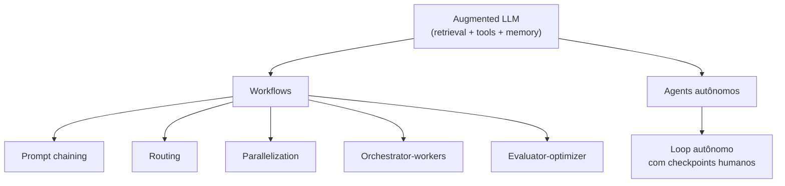

# Building Effective Agents

**Fonte:** Anthropic Engineering, dez/2024 — https://www.anthropic.com/engineering/building-effective-agents

## Por que este é o primeiro texto

Estabelece o vocabulário que todo o resto do fichamento assume como dado: a diferença entre *workflow* e *agent* não é estética, é uma decisão de design com consequências reais de custo, previsibilidade e latência.

## A distinção central: workflow vs. agent

- **Workflow**: sistemas onde LLMs e tools são orquestrados através de **caminhos de código predefinidos**. Quem decide o próximo passo é o código, não o modelo.
- **Agent**: sistemas onde o LLM **direciona dinamicamente** seu próprio processo e uso de tools, mantendo controle sobre como realiza a tarefa. Quem decide o próximo passo é o modelo, a cada iteração.

A recomendação do texto não é "use agents porque é mais avançado" — é o oposto: **comece pela solução mais simples possível** (uma chamada de API direta, sem framework), e só suba de complexidade (workflow → agent) quando a solução simples de fato não for suficiente. Complexidade é custo, não é virtude.

## O bloco básico: augmented LLM

Todo sistema agentic, seja workflow ou agent, é construído sobre a mesma peça fundamental: um LLM potencializado com augmentações — **retrieval, tools e memory**. Esse LLM aumentado consegue gerar suas próprias queries de busca, selecionar a tool apropriada para uma tarefa, e decidir que informação vale reter.

Ponto que conecta direto com o resto do fichamento: o texto recomenda explicitamente o **Model Context Protocol** como forma de integrar esse LLM aumentado a um ecossistema de tools de terceiros — ver [03](03-model-context-protocol.md).

## Os cinco padrões de workflow

| Padrão | Como funciona | Quando usar |
|---|---|---|
| **Prompt chaining** | Decompõe a tarefa em etapas sequenciais; cada chamada processa a saída da anterior | Tarefa se decompõe em subtarefas fixas; prioriza acurácia sobre latência |
| **Routing** | Classifica a entrada e direciona para um caminho especializado | Categorias distintas que se beneficiam de tratamento separado (ex.: rotear pergunta fácil pra modelo pequeno, difícil pra modelo grande) |
| **Parallelization** | LLMs trabalham simultaneamente; agregação programática dos outputs. Duas variações: *sectioning* (subtarefas independentes em paralelo) e *voting* (mesma tarefa repetida, para diversidade ou consenso) | Subtarefas paralelizáveis, ou múltiplas perspectivas aumentam confiança (ex.: guardrails em paralelo, code review de vulnerabilidades) |
| **Orchestrator-workers** | Um LLM central decompõe a tarefa dinamicamente, delega a workers, sintetiza o resultado | Subtarefas não são previsíveis de antemão — diferença chave frente à parallelization, onde as subtarefas já vêm definidas |
| **Evaluator-optimizer** | Uma chamada gera resposta, outra avalia e dá feedback, em loop | Existe critério de avaliação claro e o refinamento iterativo agrega valor mensurável (ex.: tradução literária) |

## Agentes autônomos

Começam com um comando do usuário, depois planejam e operam independentemente até haver clareza suficiente da tarefa — voltando ao humano só para informação adicional ou julgamento. A cada passo, ganham *ground truth* do ambiente real (resultado de tool, saída de código), o que permite corrigir o próprio curso.

**Quando usar**: problemas *open-ended* onde é impossível prever o número de etapas e codificar um caminho fixo — exige confiar na capacidade de decisão do próprio modelo.

**Recomendações operacionais**: testes extensivos em ambiente sandboxed, guardrails contra erro composto (um erro pequeno cedo pode virar erro grande depois de várias iterações), e design cuidadoso do conjunto de tools disponível.

## Os três princípios centrais

1. **Simplicidade** — manter o design do agente o mais simples possível.
2. **Transparência** — expor explicitamente os passos de planejamento do agente, não escondê-los.
3. **ACI (agent-computer interface)** — investir na interface entre agente e ferramentas com o mesmo cuidado que se investe numa interface humano-computador.

### ACI, em detalhe

O ponto mais concreto e mais fácil de subestimar: a descrição de uma tool precisa ser óbvia o bastante pra um "developer júnior" (no caso, o modelo) não errar o uso — exemplos, edge cases, formato de input, limites, tudo explícito. A Anthropic relata ter gasto **mais tempo otimizando as tools que otimizando o prompt geral** na tarefa SWE-bench; um exemplo citado: trocar paths relativos por absolutos eliminou uma classe inteira de erro do agente ao se mover para fora do diretório raiz.

Esse é exatamente o mesmo princípio que aparece em [04](04-build-mcp-server.md) na forma prática: a docstring de uma tool MCP *é* a interface que o modelo enxerga.

## Conexões

- O augmented LLM deste texto usa MCP como mecanismo de integração de tools → [03 · Introducing MCP](03-model-context-protocol.md)
- O princípio de ACI (documentação de tool como interface) reaparece, na prática, na forma da docstring de uma tool MCP → [04 · Build an MCP Server](04-build-mcp-server.md)

## Referências

- Anthropic Engineering — [Building Effective Agents](https://www.anthropic.com/engineering/building-effective-agents)
