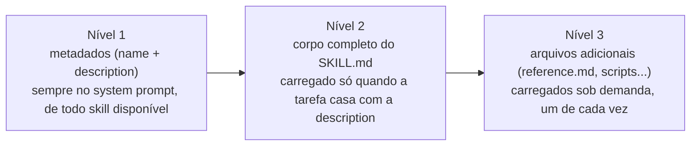

# Equipping Agents for the Real World with Agent Skills

**Fonte:** Anthropic Engineering, 2025 — https://www.anthropic.com/engineering/equipping-agents-for-the-real-world-with-agent-skills

## Por que este texto vem depois do primeiro

Se [01](01-building-effective-agents.md) estabelece que um *augmented LLM* precisa de tools e memory, este texto responde a uma pergunta prática: como empacotar **conhecimento procedural** — o "como fazer" acumulado, não só dado bruto — de um jeito que o agente consiga descobrir e carregar sob demanda, sem estourar o contexto.

## O que é um Agent Skill

Um diretório organizado contendo instruções, scripts e recursos que um agente pode descobrir e carregar dinamicamente para realizar uma tarefa especializada. A ideia central: transformar um agente *general-purpose* num agente especializado, sem precisar de fine-tuning — só de um pacote de conhecimento bem estruturado no filesystem.

## Anatomia do `SKILL.md`

- **Frontmatter YAML obrigatório**: `name` (identificação) e `description` (quando e por que usar aquele skill).
- **Corpo do arquivo**: instruções e contexto, carregados quando o skill é relevante para a tarefa.
- **Arquivos adicionais opcionais**: recursos vinculados a partir do `SKILL.md` (ex.: `reference.md`, `forms.md`, scripts executáveis) que o agente navega sob demanda, não de uma vez.

## O mecanismo central: progressive disclosure

O problema que isso resolve: ter dezenas de skills disponíveis sem estourar o orçamento de contexto do agente. A solução é carregar informação em **três níveis crescentes**:

A analogia do próprio texto: um manual bem-organizado, com índice, capítulos e apêndice — você não lê o apêndice inteiro só porque abriu o manual, lê o índice, decide o capítulo, e só abre o apêndice se precisar de um detalhe específico.

## Descoberta e execução

O agente lê o `SKILL.md` (via uma tool de leitura de arquivo/Bash) e navega os arquivos vinculados a partir dali. Um ponto importante: o agente **decide** se executa um script já escrito dentro do skill ou se usa o código como referência para gerar algo novo — o skill não obriga um caminho só.

**Exemplo dado no texto**: um skill de manipulação de PDF que inclui um script Python para extrair campos de formulário — isso permite ao agente manipular o PDF sem carregar o documento inteiro no contexto, só o resultado da extração.

## Conexões

- O "conhecimento empacotado" de um skill e as "tools conectadas via protocolo" de [03](03-model-context-protocol.md) resolvem problemas complementares, não iguais: skill é *como fazer* uma coisa específica (pode incluir scripts prontos); MCP é *como conectar* o agente a uma fonte de dado ou ferramenta externa. Um skill pode perfeitamente instruir o agente a usar uma tool exposta via MCP como parte do seu procedimento.
- O princípio de progressive disclosure (não carregar tudo de uma vez) é a mesma lógica de custo/contexto que motiva, em [01](01-building-effective-agents.md), a recomendação de manter o design do agente simples por padrão.

## Referências

- Anthropic Engineering — [Equipping Agents for the Real World with Agent Skills](https://www.anthropic.com/engineering/equipping-agents-for-the-real-world-with-agent-skills)
