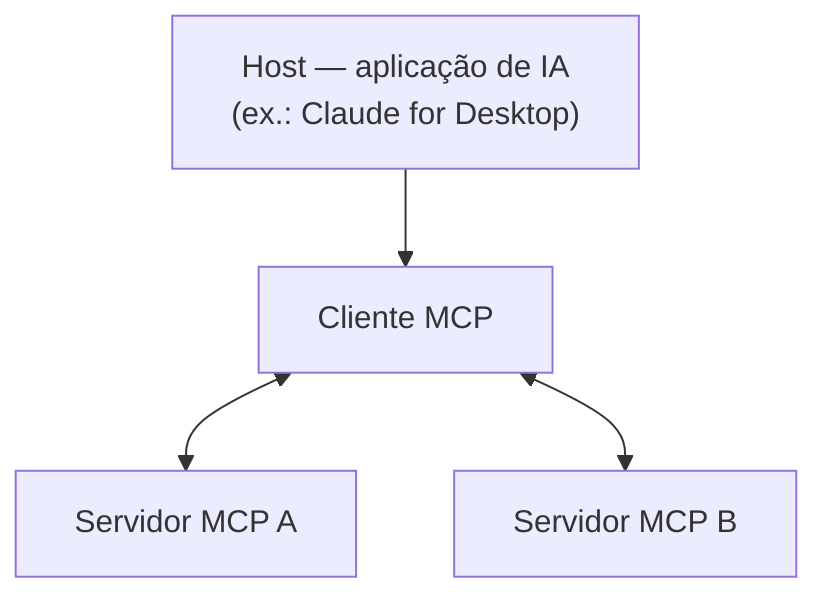

# Introducing the Model Context Protocol

**Fonte:** Anthropic, nov/2024 — https://www.anthropic.com/news/model-context-protocol

## Por que este texto vem depois dos dois primeiros

[01](01-building-effective-agents.md) já citava o MCP como a forma recomendada de dar tools a um *augmented LLM*, sem explicar o protocolo em si. Este é o anúncio que define o que é.

## O problema: integração M × N

Antes do protocolo, cada par (aplicação de IA, fonte de dado/ferramenta) exigia sua própria implementação de integração — uma combinatória que cresce mal: com *M* aplicações e *N* fontes de dado, são *M × N* integrações possíveis. O texto descreve isso como o motivo pelo qual "sistemas verdadeiramente conectados são difíceis de escalar". Um protocolo compartilhado transforma isso em *M + N*: cada aplicação implementa o protocolo uma vez, cada fonte de dado expõe um servidor uma vez, e qualquer combinação passa a funcionar.

## Arquitetura cliente-servidor

- **Servidor MCP**: expõe dados e capacidades através de uma interface padronizada.
- **Cliente MCP**: vive dentro de uma aplicação de IA (o *host*) e se conecta a um ou mais servidores.

O texto descreve isso como permitir que desenvolvedores construam "conexões seguras e bidirecionais entre suas fontes de dado e ferramentas com IA".

## O que um servidor expõe (detalhado em [04](04-build-mcp-server.md))

O anúncio original não detalha os três tipos de capacidade — isso está definido na documentação do protocolo, e o fichamento de [04](04-build-mcp-server.md) cobre a definição exata de cada um (*resources*, *tools*, *prompts*). Vale já registrar aqui que essa tripartição existe, pra não tratar o MCP como "só uma forma de chamar tool" — ele também padroniza como dar *dado* (resources) e *interação guiada* (prompts) a um agente, não só ação.

## O que foi lançado junto do anúncio

- Especificação do protocolo e SDKs (inicialmente TypeScript e Python), open source.
- Suporte local no app Claude for Desktop.
- Um repositório de servidores MCP de referência já implementados para sistemas comuns: **Google Drive, Slack, GitHub, Git, Postgres e Puppeteer**.

## Conexões

- A recomendação de [01](01-building-effective-agents.md) de usar MCP para dar tools a um augmented LLM é o motivo prático de estudar este protocolo antes de ir pra implementação.
- A implementação hands-on de um servidor, incluindo a definição precisa de *resources/tools/prompts*, está em [04](04-build-mcp-server.md).

## Referências

- Anthropic — [Introducing the Model Context Protocol](https://www.anthropic.com/news/model-context-protocol)
