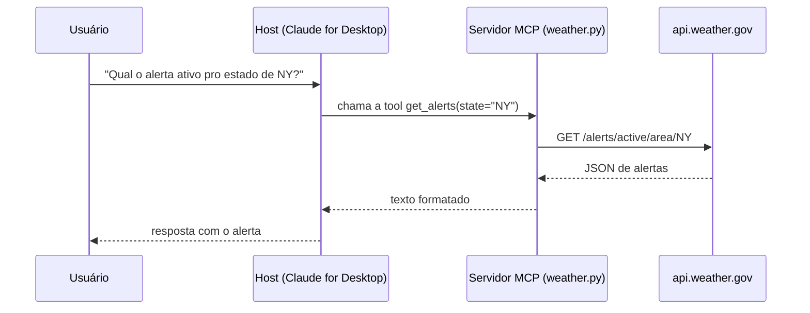

# Build an MCP Server (quickstart oficial)

**Fonte:** modelcontextprotocol.io — https://modelcontextprotocol.io/docs/develop/build-server

## Por que este texto é ação, não só leitura

Os três anteriores são conceito. Este é o guia que efetivamente vira o `mcp-toy-server/` deste repositório — a leitura só serve se sair em código rodando.

## As três capacidades de um servidor MCP (definição oficial)

Isso é o que [03](03-model-context-protocol.md) deixou em aberto:

1. **Resources** — dado "tipo arquivo" que o cliente pode ler (ex.: resposta de API, conteúdo de arquivo).
2. **Tools** — funções que o LLM pode chamar, **com aprovação do usuário**.
3. **Prompts** — templates pré-escritos que ajudam o usuário a realizar uma tarefa específica.

O guia foca em **tools** — é o caso de uso mais direto pra um primeiro servidor.

## O exemplo do guia: servidor de clima

Duas tools expostas: `get_alerts(state)` e `get_forecast(latitude, longitude)`, consumindo a API pública do National Weather Service (`api.weather.gov`). Testado conectando a um host (Claude for Desktop), mas o texto é explícito: **um servidor MCP pode se conectar a qualquer cliente**, não é exclusivo de um host.

## Fluxo de construção (SDK Python)

1. Setup do projeto com `uv` (`uv init`, `uv venv`, `uv add "mcp[cli]"`).
2. Instanciar o servidor: `mcp = MCPServer("weather")`.
3. Definir cada tool com o decorator `@mcp.tool()` — a assinatura da função (type hints) e a **docstring** viram automaticamente a definição da tool que o modelo enxerga.
4. Rodar sobre transporte stdio: `mcp.run(transport="stdio")`.
5. Conectar ao host via `claude_desktop_config.json`, no campo `mcpServers`, apontando o comando que inicia o servidor.

## O detalhe fácil de esquecer: logging em stdio

Servidor rodando sobre transporte **stdio** não pode escrever nada em stdout fora do protocolo — `print()` (Python), `console.log()` (TypeScript) e equivalentes **corrompem as mensagens JSON-RPC** e quebram o servidor. Log tem que ir pra stderr (`logging` padrão do Python já faz isso; em stdio nunca usar `print`). Em servidor HTTP isso não é problema, porque a saída não compartilha canal com o protocolo.

## Conexão direta com o ponto de ACI de [01](01-building-effective-agents.md)

Aqui o princípio vira código, literalmente: a docstring da tool **é** a interface que o modelo vê e usa pra decidir como chamar a função corretamente. Uma docstring vaga gera uma tool mal utilizada — exatamente o ponto que Building Effective Agents faz de forma abstrata, mostrado aqui de forma concreta (o parâmetro `state` documentado como "Two-letter US state code (e.g. CA, NY)" não é redundância, é o que evita o modelo mandar `"New York"` por engano).

## Conexões

- Implementa, na prática, os três primitivos definidos conceitualmente em [03](03-model-context-protocol.md).
- A docstring-como-interface é o princípio de ACI de [01](01-building-effective-agents.md) em forma de código.

## Referências

- Model Context Protocol — [Build an MCP Server](https://modelcontextprotocol.io/docs/develop/build-server)
- Código de referência do exemplo (Python) — https://github.com/modelcontextprotocol/quickstart-resources/tree/main/weather-server-python
